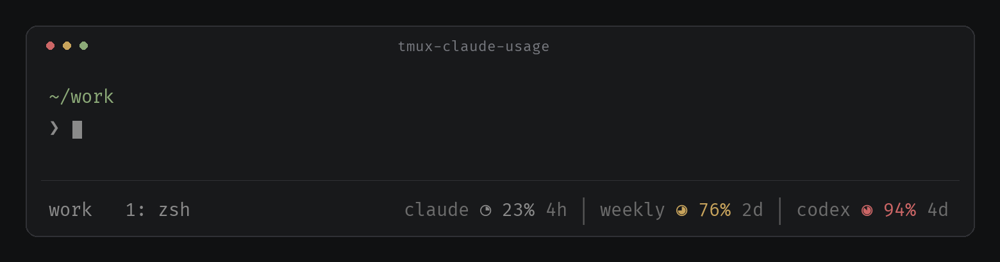

# tmux-claude-usage

Claude and Codex usage in your tmux status bar: compact gauges, color-coded percentages, and time until reset. Reads local usage data without extra API calls.



*Preview with sample values: Claude’s 5-hour window, Claude’s weekly budget, and Codex’s weekly budget. Percentages show usage consumed; countdowns show time until reset.*

## Install & configure

Requires **tmux 3.0+**, **jq**, and a **Nerd Font v3+** selected in your terminal. Your Claude Code / Codex sessions must provide usage limit data.

```sh
git clone https://github.com/alchemmist/tmux-claude-usage.git \
  ~/.tmux/plugins/tmux-claude-usage
bash ~/.tmux/plugins/tmux-claude-usage/scripts/init.sh
```

The installer connects Claude Code’s usage harvester, backs up its settings, and preserves an existing status line. Codex usage is read automatically from local session logs.

Add this to `~/.tmux.conf`, after your theme settings:

```tmux
set -g @claude_usage_style gauge
set -g @claude_usage_claude on
set -g @claude_usage_claude_show all
set -g @claude_usage_show_reset on
set -g @claude_usage_icon claude
set -g @claude_usage_weekly_icon weekly
set -g @claude_usage_codex on
set -g @claude_usage_codex_show weekly
set -g @claude_usage_codex_icon codex

set -g @claude_usage_color_normal "#8a8a8a"
set -g @claude_usage_color_warning "#c8a45c"
set -g @claude_usage_color_critical "#cc6666"
set -g @claude_usage_label_color "#6c6c6c"
set -g @claude_usage_separator "#[fg=#585858] │ #[default]"

set -g status-right-length 120
set -g status-right '#{claude_usage} '
set -g status-interval 5

run-shell ~/.tmux/plugins/tmux-claude-usage/claude-usage.tmux
```

Reload with `tmux source-file ~/.tmux.conf`, then use Claude Code and Codex normally to populate the readings. Claude updates when its status line renders; Codex checks the most recently modified sessions and caches the reported windows for 60 seconds. Missing windows stay hidden.

Using **TPM**? Replace the `run-shell` line with `set -g @plugin 'alchemmist/tmux-claude-usage'`, keep TPM initialization last, and press `prefix + I`. Run `scripts/init.sh` once after installation.

Choose each assistant and its windows independently:

| Option | Values | Default |
| --- | --- | --- |
| `@claude_usage_claude` | `on`, `off` | `on` |
| `@claude_usage_codex` | `on`, `off` | `off` |
| `@claude_usage_claude_show` | `weekly`, `current`, `all` | `current` |
| `@claude_usage_codex_show` | `weekly`, `current`, `all` | `weekly` |

`current` means the short usage-limit window (5 hours for Claude), not context-window usage. `all` shows current and weekly together. Codex only displays windows present in its session data. To name its weekly window separately, set `@claude_usage_codex_weekly_icon "codex weekly"`.

For example, show both assistants’ weekly limits with both switches `on` and both `_show` options set to `weekly`. Set either `_show` to `all` to add its current usage, or set an assistant to `off` to hide it.

Older configs using `@claude_usage_show` and `@claude_usage_codex_only` still work; the explicit Claude options above take precedence.

If Claude stays blank, run `bash ~/.tmux/plugins/tmux-claude-usage/scripts/init.sh --check`.

Fork of [docker-run/tmux-claude-usage](https://github.com/docker-run/tmux-claude-usage), adding Codex usage and compact gauges. [MIT](LICENSE).
